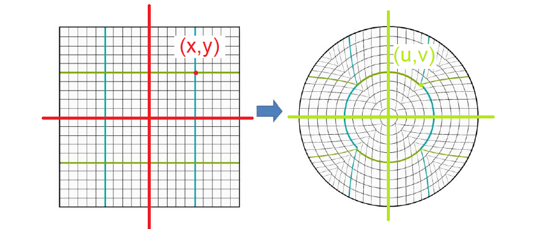
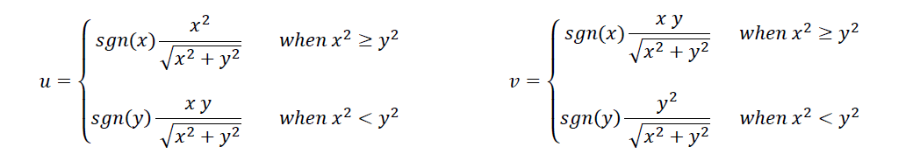

# Introduction
This library is for the receiver end of the Cytron PS2 Shield (reference  [here](https://www.cytron.io/p-shield-ps2)).

# User guide
## Downloading the library
It is suggested that you download the entire repository and then select this folder, so that you can enjoy the benifits of VCS like git. It makes it simpler to update the contents whenever patch fixes are done. You can simply open a terminal (or gitbash on windows), go to the folder where you want to save this repository and type the following command.
```
git clone https://github.com/shashank3199/Cytron_PS2_Shield
```

**Not recommended**: You can download _only_ this folder by clicking [here](https://minhaskamal.github.io/DownGit/#/home?url=https://github.com/shashank3199/Cytron_PS2_Shield)

## Using the library with Arduino
Move this folder into the arduino libraries folder on your PC. If you don't know where the libraries folder of your arduino is, you can click [here](https://www.arduino.cc/en/hacking/libraries).<br>
Also, this Library makes use of the [DebuggerSerial Library](../DebuggerSerial). For More Information on this, click [here](https://github.com/RoboManipal-9-0/Libraries/tree/master/DebuggerSerial).

In order to use this library, you must do the following:
- Include the header file `Cytron_PS2_Shield.h` (the *Cytron_PS2_Shield* library folder must be in your arduino libraries folder).
- Create an object of class `Cytron_PS2_Shield`. You can pass the constructor parameters to initialize here itself, or leave it as a simple object declaration.
- Initialize the Serial stream on which the PS2 is attached using the `AttachPS2Serial` function. You may optionally initialize and attach a debugger serial as well (using `debugger.Initialize` function on the object). You can access the debugger using the `debugger` variable of the class.
- To avoid wastage of resources, the library doesn't continuously poll the serial. You must call the function `UpdateData` for the library to fetch the values from the serial.
- To get the values, you can use one of the getter functions, for example if you want to access the X_Axis value, then you could use any of the following functions:
    - **GetX_Axis_Raw** will give you the raw X_Axis value as returned by the PS2 Controller.
    - **GetX_Axis** will give you the processed X_Axis Value (mapped according to the Convention explained below).

# Library Explanation
The Library uses Simple Stretching Model for Mapping the Joystick Values from Cartesian to Polar Coordinate System as Shown in the Following Figure -



The Formula for the Mapping is -



## Examples

### Read_Joystick
This example is to show you how to fetch Joystick values from the PS2 Controller using the `Cytron_PS2_Shield` library.<br>
File: [Cytron_PS2_Shield/examples/Read_Joystick/Read_Joystick.ino](./examples/Read_Joystick/Read_Joystick.ino)<br>

We simply follow the following steps:
1. Include library
2. Create object
3. Initialize Serials. PS2 on **Serial2** and debugger on **Serial**. Keep in mind to match the baud rates.
4. Initialize debugger. Name it `PS2`.
5. Attach the serial of the PS2 Shield
6. Then start a loop
    1. Update the data readings from Controller
    2. Get Axis Values and Polar Values.
7. Re-run the loop

### Read_Button
This example is to show you how to fetch Button values from the PS2 Controller using the `Cytron_PS2_Shield` library.<br>
File: [Cytron_PS2_Shield/examples/Read_Joystick/Read_Button.ino](./examples/Read_Joystick/Read_Button.ino)<br>

We simply follow the following steps:
1. Include library
2. Create object
3. Initialize Serials. PS2 on **Serial2** and debugger on **Serial**. Keep in mind to match the baud rates.
4. Initialize debugger. Name it `PS2`.
5. Attach the serial of the PS2 Shield
6. Put the Relevant Parameter for readButton from the values mentioned.
7. The Status of the Button is Printed as a Boolean State in the Serial Monitor.

# Developers guide

## Library Details
### Files in the Library
The files in the library are :

#### Cytron_PS2_Shield.h
This is the Header file and contains the Class Blueprint (Prototype).

#### Cytron_PS2_Shield.cpp
This file contains the Definiton for the Class Member Functions Prototyped in the Header File.

#### README.md
The Description file containing details about the library. The file that you looking at right now.

# Class Contents
Let's explore the contents of the class, but first, we also have literals defined for general purpose use (using `#define`). They are:

| Name | Value | Purpose |
|:----:| :----: | :----- |
| RIGHT_JOYSTICK| 0 | Value passed to select the Right Joystick on the Controller for the Joystick Functions |
| LEFT_JOYSTICK | 1 | Value passed to select the Right Joystick on the Controller for the Joystick Functions |

| Name | Value | Purpose |
|:----:| :----: | :----- |
| X_AXIS| 0 | The index of Axis Values in the Array |
| Y_AXIS | 1 | The index of Axis Values in the Array |

| Name | Value | Purpose |
|:----:| :----: | :----- |
| ANGLE | 0 | The index of Polar Values in the Array |
| RADIUS | 1 | The index of Polar Values in the Array |

  |  Button Category |Parameters  for the readButton Function |
  | :----------------:|:-----------------: |
  |Direction Buttons : |PS2_UP,  PS2_RIGHT,  PS2_DOWN,  PS2_LEFT|
  |Control Buttons : |PS2_SELECT,  PS2_JOYSTICK_LEFT,  PS2_JOYSTICK_RIGHT,  PS2_START|
  |Special Action Buttons: |PS2_TRIANGLE,  PS2_CIRCLE,  PS2_CROSS,  PS2_SQUARE|
  |Trigger Buttons: |PS2_LEFT_2,  PS2_LEFT_1,  PS2_RIGHT_1, PS2_RIGHT_2|

  Let's explore the class now

### Private members

##### Variables
  - **<font color="#CD00FF">int</font> Joystick**: Selects the Joystick which will be used for getting the Axis Values.
  - **<font color="#CD00FF">int</font> Axis_raw_values[2]**: Stores the raw values (0 to 255, as output by the module) of X-Axis and Y-Axis.
  - **<font color="#CD00FF">int</font> Axis_scaled_values[2]**: Stores the Mapped values (-127 to 127).
  - **<font color="#CD00FF">float</font> Polar_Values[2]**: The Calculated Polar Values for the Circle to which the Axis values are mapped.
  - **<font color="#CD00FF">Stream</font> \*PS2Serial**: This is the serial on which PS2 operates. The parent **Stream** class allows any kind of serial, **Hardware** or **Software**.

#### Member functions
  - **<font color="#CD00FF">void</font> <font color="#5052FF">write</font>(uint_8 data)**: Used to send Data to the Shield.
  - **<font color="#CD00FF">uint_8</font> <font color="#5052FF">read</font>()**: Used to recieve Data from the Shield.

### Public members
#### Members
  - **<font color="#CD00FF">DebuggerSerial</font> debugger**: The debugger for the class. Check the [DebuggerSerial documentation](./../DebuggerSerial/) for more on this.

#### Constructors
  - **<font color="#5052FF">Cytron_PS2_Shield</font>()**: Empty constructor for the class.
  - **<font color="#5052FF">Cytron_PS2_Shield</font>(Stream \*AttachedSerial)**: To attach a pre-initialized serial to the PS2. This function calls the _AttachPS2Serial_ member function.
  - **<font color="#5052FF">Cytron_PS2_Shield</font>(int Joystick)**: To select the Joystick which will be used with the PS2. This function calls the _SetJoystick_ member function.
  - **<font color="#5052FF">Cytron_PS2_Shield</font>(Stream \*AttachedSerial,int Joystick)**: Combination of the above two Constructors.

#### Member functions
  - **<font color="#CD00FF">void</font> AttachPS2Serial(<font color="#FF00FF">Stream</font> \*AttachedSerial)**: Connect the PS2 Serial.
  - **<font color="#CD00FF">void</font> UpdateData()**: Updates the PS2 values stored in variables of the class.
  - **<font color="#CD00FF">void</font> SetJoystick(int Joystick)**: To select the Joystick which will be used with the PS2.
  - **<font color="#CD00FF">uint_8</font> readButton(uint_8 key)**: To Read the Status of a Button on the Controller.
  - **<font color="#CD00FF">int</font> GetX_Axis_Raw()**: To get the Raw value of X-Axis.
  - **<font color="#CD00FF">int</font> GetY_Axis_Raw()**: To get the Raw value of Y-Axis.
  - **<font color="#CD00FF">int</font> GetX_Axis()**: To get the Scaled value of X-Axis.
  - **<font color="#CD00FF">int</font> GetY_Axis()**: To get the Scaled value of Y-Axis.
  - **<font color="#CD00FF">float</font> GetPolarAngle()**: To get the angle on the Circular mapping.
  - **<font color="#CD00FF">float</font> GetPolarRadius()**: To get the radius on the Circular mapping.


  # References
  - [Paper for reference](./.DATA/MappingReference.pdf): Analytical Methods for Squaring the Disc

[](https://github.com/shashank3199)